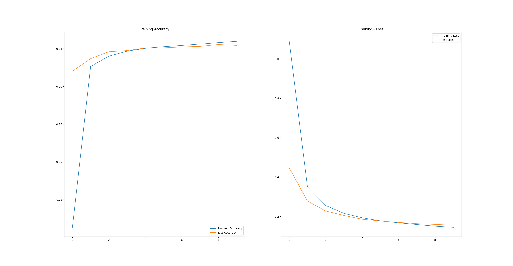
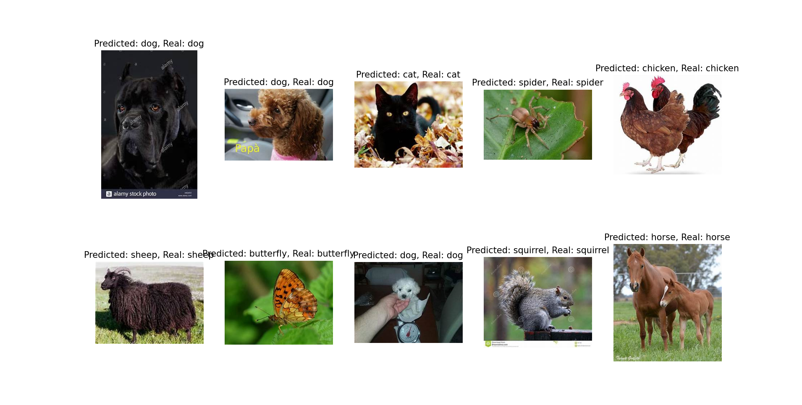

# 华中科技大学人工智能作业

此为华中科技大学 2025 年研究生课程——人工智能作业

## 题目

以 Python 作为主要编程语言，使用 `Pytorch/TensorFlow/MindSpore` 框架，构建卷积神经网络模型，实现对动物图像的分类任务。

## 数据集

使用的训练集/测试集如下：

[Animal-10](https://www.kaggle.com/datasets/alessiocorrado99/animals10)

包含 10 种动物类型：

```python
translate = {"cane": "dog", "cavallo": "horse", "elefante": "elephant", "farfalla": "butterfly", "gallina": "chicken", "gatto": "cat", "mucca": "cow", "pecora": "sheep", "scoiattolo": "squirrel", "dog": "cane", "cavallo": "horse", "elephant" : "elefante", "butterfly": "farfalla", "chicken": "gallina", "cat": "gatto", "cow": "mucca", "spider": "ragno", "squirrel": "scoiattolo"}
```

总共 26179 张动物图像，其中随机使用 80% 作为训练集，20% 作为测试集
## ResNet

是 CNN 中经典的网络架构，常用于图像识别，目前最新的网络架构或多或少有参考 ResNet 的思想，即残差链接，便于增加神经网络的深度。

## 训练过程

### 网络架构

训练采用 pytorch 中预设的 resnet-18 进行训练，共有 18 层 resnet block。

### 超参数

```python
learning_rate=1e-3
epochs = 10
batch_size = 512
```

### 日志
```shell
2.8.0+cu129
cuda
Class Number:  ['dog', 'horse', 'elephant', 'butterfly', 'chicken', 'cat', 'cow', 'sheep', 'spider', 'squirrel']
26179
20943 5236
data shape[N, C, H, W]:  torch.Size([512, 3, 224, 224])
labels:  tensor([0, 8, 9, 0, 3, 1, 0, 9, 0, 4, 0, 8, 7, 4, 1, 0, 2, 0, 6, 0, 0, 9, 9, 8,
        9, 5, 8, 7, 4, 6, 1, 8, 3, 7, 6, 1, 4, 5, 3, 4, 2, 3, 1, 3, 4, 1, 1, 0,
        0, 0, 6, 1, 4, 8, 2, 3, 3, 2, 2, 4, 0, 0, 8, 4, 6, 1, 6, 0, 0, 7, 8, 8,
        9, 9, 5, 6, 2, 8, 0, 7, 4, 1, 9, 8, 5, 4, 0, 6, 7, 0, 4, 8, 3, 3, 0, 9,
        6, 3, 0, 1, 0, 0, 3, 7, 6, 0, 8, 8, 9, 8, 7, 4, 1, 8, 6, 0, 4, 0, 4, 2,
        1, 9, 4, 4, 0, 4, 6, 7, 6, 8, 0, 0, 0, 9, 9, 8, 1, 1, 8, 7, 1, 3, 8, 2,
        8, 9, 2, 6, 8, 0, 0, 0, 4, 0, 9, 9, 8, 0, 2, 0, 3, 3, 8, 0, 3, 1, 8, 4,
        4, 0, 1, 8, 0, 8, 3, 9, 8, 0, 3, 0, 4, 0, 4, 3, 7, 8, 8, 9, 4, 2, 1, 0,
        0, 8, 8, 1, 2, 0, 0, 9, 4, 4, 0, 1, 8, 9, 5, 8, 5, 8, 3, 5, 4, 6, 5, 7,
        0, 0, 2, 2, 0, 8, 0, 8, 8, 4, 9, 2, 8, 0, 0, 1, 3, 2, 5, 9, 8, 6, 7, 0,
        8, 8, 1, 5, 1, 4, 0, 0, 0, 7, 0, 9, 8, 8, 0, 6, 4, 8, 4, 3, 8, 0, 5, 5,
        0, 8, 0, 8, 8, 6, 8, 6, 0, 3, 8, 0, 4, 1, 5, 8, 7, 0, 0, 8, 7, 4, 6, 6,
        8, 0, 0, 7, 2, 1, 7, 7, 7, 1, 3, 2, 3, 8, 7, 6, 0, 0, 0, 6, 8, 8, 4, 9,
        2, 7, 8, 8, 7, 1, 2, 8, 4, 8, 8, 7, 3, 5, 1, 6, 2, 8, 8, 8, 0, 0, 6, 5,
        5, 7, 3, 0, 5, 5, 8, 8, 6, 7, 9, 4, 4, 8, 0, 4, 8, 5, 4, 3, 0, 0, 0, 8,
        7, 7, 0, 0, 0, 7, 4, 7, 9, 0, 9, 8, 6, 5, 8, 9, 0, 1, 3, 7, 4, 9, 6, 1,
        5, 9, 0, 0, 0, 0, 7, 7, 0, 9, 6, 4, 8, 4, 8, 0, 3, 1, 9, 8, 2, 8, 4, 0,
        0, 3, 5, 1, 7, 3, 0, 2, 3, 6, 6, 7, 6, 1, 0, 8, 8, 8, 3, 5, 6, 8, 4, 4,
        0, 4, 4, 8, 2, 1, 4, 9, 8, 7, 5, 0, 1, 6, 8, 0, 0, 0, 5, 5, 2, 5, 4, 1,
        4, 6, 9, 8, 8, 0, 0, 3, 8, 6, 4, 3, 9, 4, 6, 1, 4, 8, 2, 0, 6, 4, 4, 5,
        0, 8, 1, 4, 3, 5, 4, 5, 3, 4, 7, 4, 6, 7, 3, 8, 0, 2, 1, 5, 5, 2, 2, 1,
        0, 3, 4, 0, 6, 4, 0, 8])
Epoch: 1, Train_acc:71.3%, Train_loss:1.090, Test_acc:92.0%, Test_loss:0.446
Epoch: 2, Train_acc:92.6%, Train_loss:0.350, Test_acc:93.7%, Test_loss:0.278
Epoch: 3, Train_acc:94.0%, Train_loss:0.256, Test_acc:94.6%, Test_loss:0.228
Epoch: 4, Train_acc:94.7%, Train_loss:0.216, Test_acc:94.7%, Test_loss:0.205
Epoch: 5, Train_acc:95.0%, Train_loss:0.193, Test_acc:95.1%, Test_loss:0.186
Epoch: 6, Train_acc:95.3%, Train_loss:0.177, Test_acc:95.1%, Test_loss:0.177
Epoch: 7, Train_acc:95.4%, Train_loss:0.167, Test_acc:95.2%, Test_loss:0.169
Epoch: 8, Train_acc:95.6%, Train_loss:0.158, Test_acc:95.3%, Test_loss:0.162
Epoch: 9, Train_acc:95.8%, Train_loss:0.150, Test_acc:95.6%, Test_loss:0.159
Epoch:10, Train_acc:96.0%, Train_loss:0.144, Test_acc:95.4%, Test_loss:0.155
Done
```

### 可视化
1. 模型训练相关

2. 模型测试


## 复现

+ 请自行下载合适版本的 pytorch pytorchvision 
+ 其他依赖，可使用 `uv sync` 进行同步
+ 执行 `main.py` 即可，main 函数用于模型训练，run 函数用于模型测试

## 产生式系统与深度学习方法的差异

### 产生式系统
产生式系统是早期人工智能的一个重要分支，它模仿人类专家的决策过程。其核心思想是将知识表示为一组“如果-那么”（IF-THEN）形式的规则，
是一种基于符号主义人工智能的方法，主要包含以下三个部分：

+ 知识库（Knowledge Base）： 包含了关于动物分类的规则。
+ 事实库（Fact Base / Working Memory）： 用于存储用户输入的关于特定动物的已知特征。
+ 推理机（Inference Engine）： 负责将事实库中的事实与知识库中的规则进行匹配，并根据匹配结果得出结论。

通常来说，产生式系统具有以下特点：
+ 产生式系统的规则由人类专家手动编写和定义，系统本身不具备自主学习能力；
+ 整个推理过程具有高度的逻辑性和可解释性，这与当今流行的方法差异巨大；
+ 同时，产生式系统不具备处理超出规则之外的情况的能力等。

### CNN 等深度学习方法
CNN 等深度学习方法则是通过从大量数据中提取隐特征，这与产生式系统迥然不同，具有以下特点：
+ 需要大量数据进行学习，可以适应不同的数据集，学习能力强；
+ CNN 的“知识”蕴含于网络中的隐藏层中，往往时不可描述、不可解释的；
+ CNN 的推理过程也很难像产生式系统那样具备逻辑性和可解释性，我们无法解释网络为什么会做出对应的决策。

